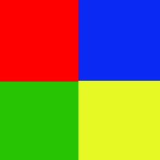
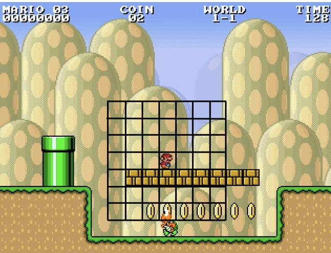



Let me set the scene: Colorado College, the infamous Block Plan, and me—armed with caffeine, optimism, and a vague understanding of Python. In just 3.5 weeks (yes, you read that right), I tackled a semester’s worth of Artificial Intelligence projects. Here are the three that left the biggest mark (and, occasionally, a dent in my sanity).

---

## The most fun challenges

### 1. TensorFlow Set Solver: Can a Neural Net Play SET Better Than Me?

SET is a card game that’s equal parts logic puzzle and optical illusion. I figured, why not make a neural network do the heavy lifting?



- **What I built:** A Python program that scans a photo of a SET board, detects cards, and tries to identify them using two neural networks—one for visibility (is there a card here?) and one for recognition (which card is it?).
- **How it works:** The code slides a window over the board image, uses the visibility model to spot cards, and then the recognition model to guess which card is present. It tallies up "votes" for each card position and prints out its best (and second-best) guesses.
- **What I learned:** Training neural nets is hard. Getting them to work on real, messy images is even harder. But seeing the model actually recognize cards (sometimes!) was a huge win.

*Side note*: Debugging image data is like herding cats. If you ever want to feel humble, try it.

---

### 2. Othello AI: Bots, Boards, and the Joy of Getting Crushed

*Image credit: Toru Kimura/Shutterstock*

Othello (a.k.a. Reversi) is a classic strategy game, and for this project, I went all-in: Java GUI, multiple AI bots, and a whole lot of game logic.

- **What I built:** A full Othello game engine with a graphical board, support for human and AI players, and several bot strategies (random, greedy, and minimax).
- **Cool features:** The minimax bot tries to look ahead and make the smartest move, while the greedy bot just grabs the most pieces it can each turn. You can play against the computer or watch bots battle it out.
- **What I learned:** Implementing minimax was a brain workout, but seeing the bots improve (and sometimes beat me) was super satisfying. Also, GUIs are fun—until they aren't.

*Fun fact*: My minimax bot once lost to the random bot. I still have trust issues.

---

### 3. Genetic Algorithm Art: Evolving Images, One Polygon at a Time

This one was part science, part digital art experiment. The goal? Use a genetic algorithm to "evolve" a set of colored polygons that mimic a target image.

- **What I built:** A Java program that starts with a population of random polygon arrangements and, through crossover and mutation, gradually makes them look more like a given picture.
- **How it works:** Each "solution" is a set of polygons. The fitness function compares the generated image to the target, and the best solutions get to "reproduce." Over thousands of generations, the results get spookily close to the original.
- **What I learned:** Evolutionary algorithms are mesmerizing to watch. Sometimes, the program would get stuck in a rut, but with a tweak to mutation rates, it would suddenly leap forward.

*Pro tip*: If you want to feel like a mad scientist, watch your computer "paint" with polygons at 2 a.m.

---

### 4. MarioAI: Teaching a Bot to Run, Jump, and (Sometimes) Survive

Who hasn't wanted to build their own Mario bot? For this project, I dove into the MarioAI competition framework and tried to teach an agent to play Super Mario Bros. (or at least, not immediately fall into a pit).

- **What I built:** A Java agent that controls Mario, using simple logic to decide when to run, jump, and speed up. The agent tries to jump over obstacles and keep moving right—sometimes with hilarious results.
- **How it works:** The bot checks if Mario can jump or is in the air, and then presses the jump and speed buttons accordingly. It's not exactly AlphaGo, but it gets the job done (most of the time).
- **What I learned:** Platformer AI is tricky! Timing jumps and reacting to the environment is harder than it looks. Watching the bot fail in new and creative ways was half the fun.

*Side quest*: If you ever want to appreciate human reflexes, watch your bot miss the same jump 20 times in a row.

---

## Other Projects from this Course

Here's a quick rundown of the other projects I tackled during those 3.5 weeks:

- **Linear Regression:** Implemented linear regression for data analysis tasks.
- **Clustering:** K-means clustering on movie ratings data.
- **AISearch:** Search algorithms (BFS, DFS, A*, etc.) for solving sliding puzzles and other problems.

## Source Code



---

## Reflections & Takeaways

- **AI is messy:** Real-world data is never as clean as textbook examples. Embrace the chaos.
- **Bots are humbling:** Sometimes your "smart" AI will lose to random chance. That's life (and debugging).
- **Evolution is cool:** Watching solutions improve over time is weirdly addictive.

If you're curious about the code or want to see some of the (occasionally hilarious) results, try running my code and let me know how it goes in the comments! And remember: every bug is just an undocumented feature waiting to be discovered.

---

*No neural networks were harmed (permanently) in the making of these projects.*
