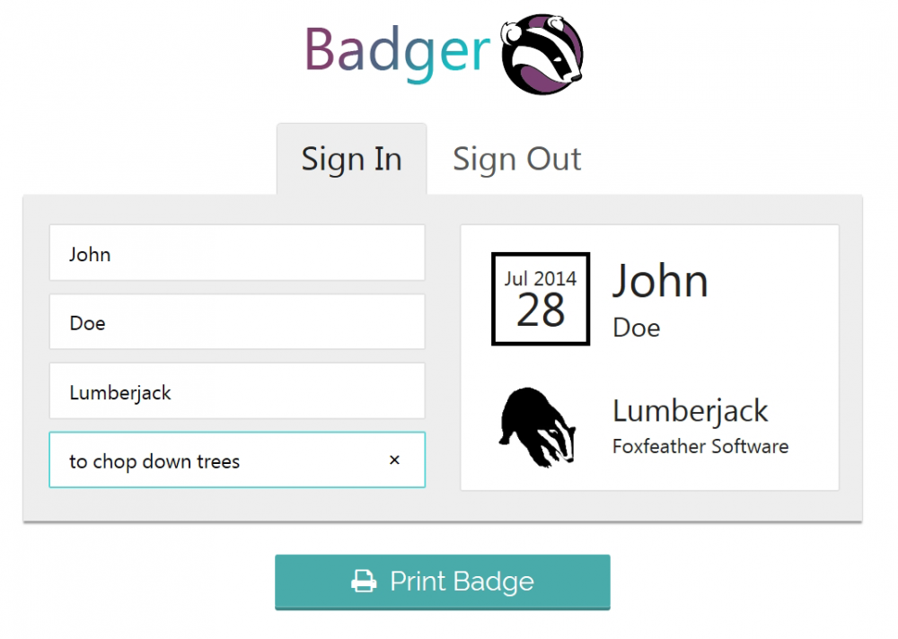
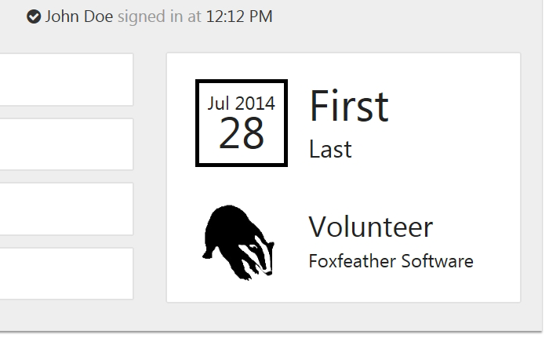
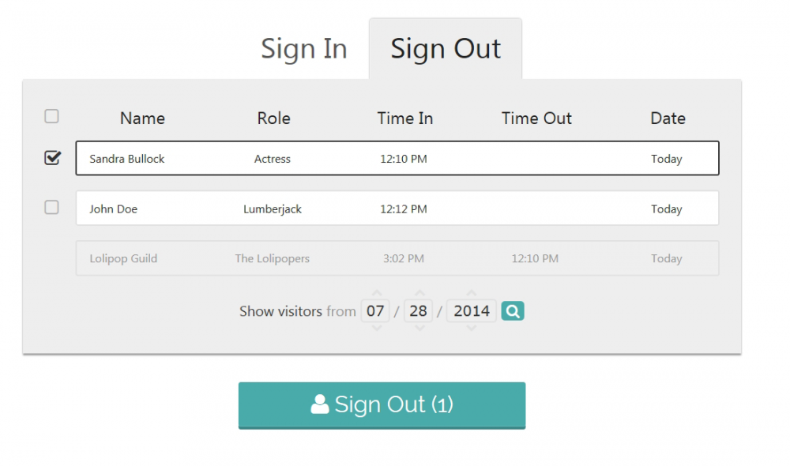
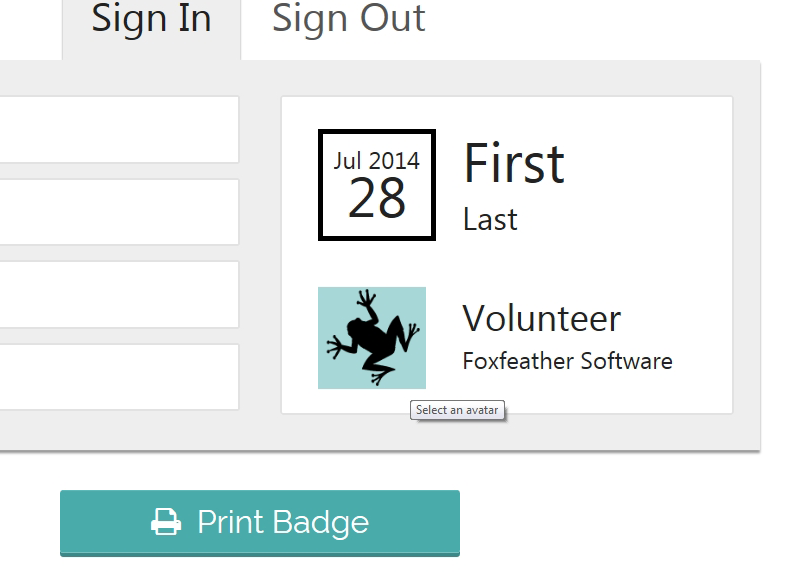

+++
date = "2015-05-21T23:46:55-06:00"
draft = false
title = "Badger: Enterprise Security App for Brick-and-Mortar"
# original_title = "Badger Prototype: Enterprise Web Application for Brick and Mortar Security"
tags = ["HTML/CSS", ".NET", "VB", "JavaScript", "Mobile Development", "Professional", "Programming", "Web Design"]
categories = ["App", "Business", "Project", "Mobile", "Web"]
thumbnail = "/project/badger/images/featured.png"
summary = "An enterprise web application for brick-and-mortar business security that allows visitors to sign in via mobile devices or kiosks to receive printed nametags with real-time tracking and administrative oversight."
+++



Nametags?? That's right. Badger is proprietary software in the form of a web app designed to secure brick and mortar businesses. It's fun and intuitive, and to be clear, it was NOT my idea. I worked on Badger as part of a team at [Foxfeather Software](http://www.foxfeathersoftware.com/); I was the lead programmer and created the user interface.

When a business uses Badger, volunteers, consultants, employees, or any guest in the building can sign in upon arrival via their personal mobile device or the business' kiosk and instantly pick up their printed nametag, featuring their name, role, date verified, and even a selectable avatar. This is a quick and dirty solution for businesses that wish to comply with the highest security standards. Administrators can access the backend of the web application and instantly see a list featuring every person currently signed in and present in the building, including the time they signed in. This information can easily be provided to emergency personnel, as this too is accessible on any authenticated mobile device.

## Simple, Responsive

Designed with simplicity and ease-of-use in mind for the best user experience. Layout is responsive for a seamless transition to tablets and phones.

## Secure

In addition to being attractive and clearly legible, our date-stamped badges are more secure than handwritten nametags and cannot be counterfeited.

## Convenient

Automatically registers visitors into a searchable database organized by date. This can be integrated with your own database to enforce unique sign-ins.

## Customizable

Ability to personalize badges with avatars adds a fun factor and promotes team identities.

Isn't the UI nice? My brother Kirby designed it. He also designed much of this website! We make a good team.
