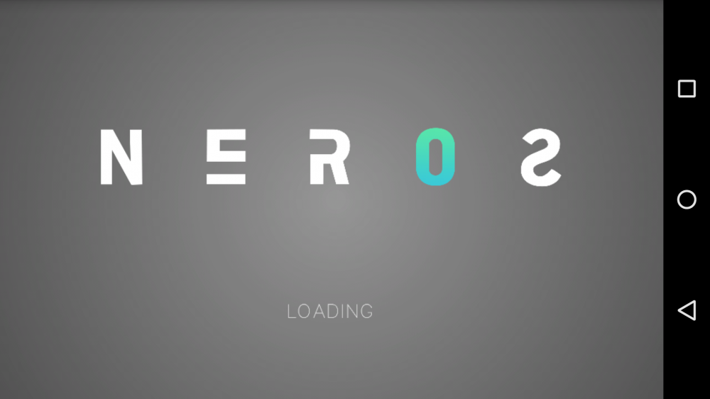

+++
date = "2014-05-31T23:22:45-06:00"
draft = false
title = "GRAVL: Gravity Puzzle Platformer for Android"
# original_title = "GRAVL: A Gravity Puzzle Platformer for Android"
tags = ["2D Graphics", "Computer Graphics", "Game Development", "HTML/CSS", "Java", "Mobile Development", "Physics", "Professional"]
categories = ["App", "Business", "Games", "Mobile", "Project", "Web"]
thumbnail = "/project/gravl-game/images/featured.png"
summary = "An independently developed Android puzzle platformer where players control astronaut Phil manipulating gravity to navigate icy terrain, built entirely in Java without game engines over 800 hours of development."
+++



## Watch the Trailer





More than 800 hours over the course of 6 months went into making [**GRAVL**](https://dinosoeren.github.io/gravlgame/), my first independently developed Android game, from start to finish. As you may have noticed from the article's title, it's a platform game (like Super Mario Bros.), except each level is a puzzle that can only be solved using one thing... gravity.

You play as Phil, a stranded astronaut who's trying to collect fuel for his spaceship, while traversing the bizarre icy terrain of an unknown planet. You encounter many different types of **Gravity Switches** along the way, which allow Phil to freely manipulate the laws of physics, to help you avoid falling to your death.




This game was more of a programming experiment for me than anything else. I chose not to use any game or physics engines like Unity, and instead chose to program every aspect of the game in pure Java, starting from scratch. This is the primary reason it took so damn long, and also why I wouldn't recommend this approach to anyone whose goal is to efficiently develop a functional game. Don't reinvent the wheel unless you have to, or in my case, unless you want to just for the lolz.

All the graphics in the game are completely original, created by me. The music/sounds are also original; they were composed by my brother Kirby. GRAVL has had its fair share of performance bugs, which have been a pain to fix, but also kinda fun to figure out. I now know the inner workings of Android like never before. You'd be surprised how many different programming and **math** concepts go into developing a game.

In order to complete this project (which was really my first attempt to create something substantial using Java), I had to learn about:

- Programming for Android
- Background threads
- Runnables
- Bitmap scaling & rendering (pain in the ass!)
- Game controller integration
- Surface view canvas drawing
- Cloud syncing and conflict resolution with Amazon GameCircle and Google Play Services
- Libraries and dependency order
- Slow framerate compensation (and throttling for devices that were TOO fast)
- Hardware acceleration
- Using abstract Java classes for framework layers
- Device compatibility workarounds
- Audio/sound integration
- and tons more.

I also had to use some concepts from trigonometry, like **Pythagorean Theorem** (a big middle finger to all my high school classmates who said we'd never use it outside of school), and I had to come up with some pretty hardcore algorithmic solutions for various issues I ran into along the way.

If you want to read or hear more, I was [**interviewed by Literary Video Games**](http://www.literaryvideogames.com/2014/07/interview-soeren-walls-creator-of-gravl.html) about GRAVL; feel free to check that out. I must say, this is one of my projects I'm most proud of, just because of how ridiculous of an undertaking it was. The day I released GRAVL was one of the most satisfying days of my life. But I can guarantee you, I will never attempt make a game without an engine again. Still, it was fun.

## Screenshots

