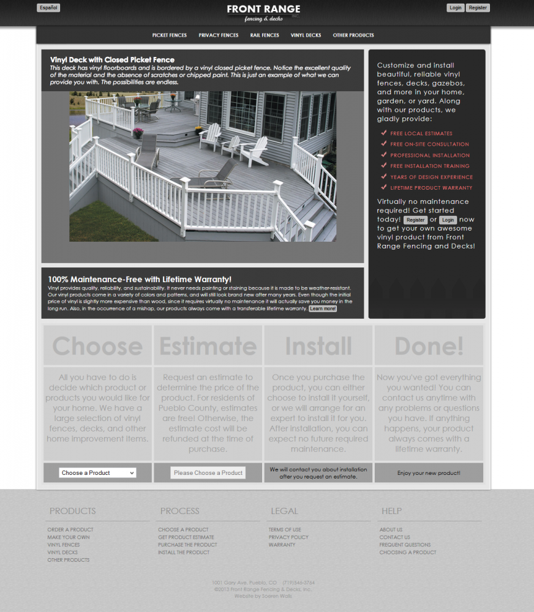
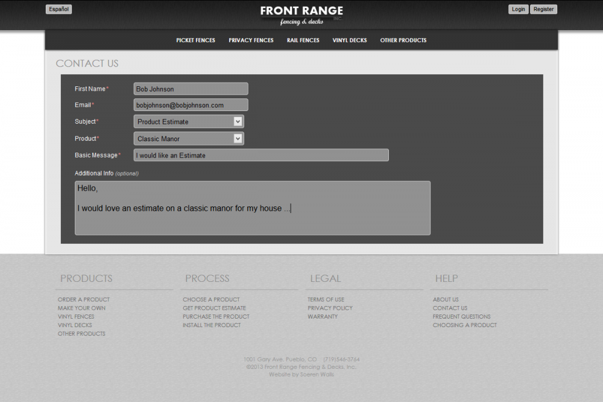
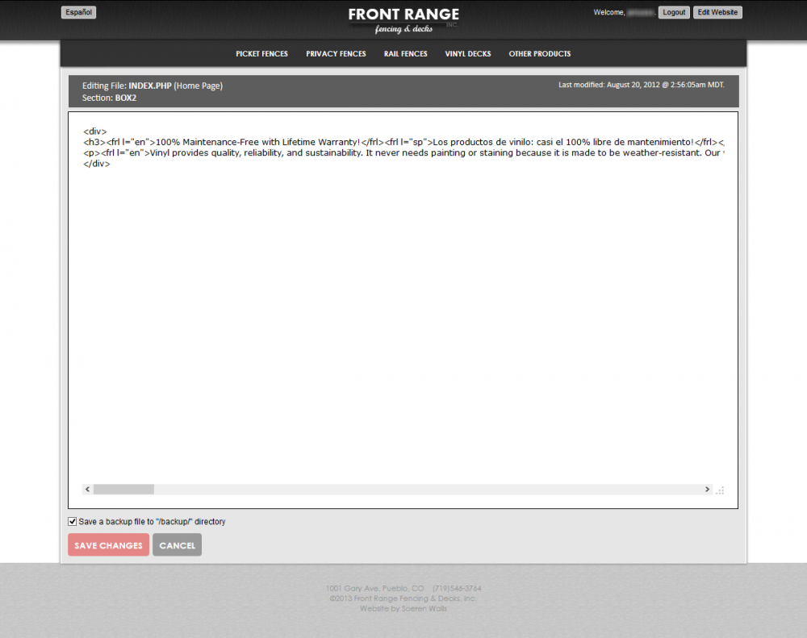



An entirely original site made for a fencing business, featuring product pages, Spanish and English translations for all pages, a custom-made admin backend, and user login/registration. It's made like any good website. HTML, CSS, Javascript, PHP, and SQL. Done, done, and done.

## Project Narrative

In the summer before my senior year at SEBS, I took on a project that would become my first real-world foray into building software for someone else’s business. My teacher, who ran a fencing and decking side hustle, needed a website that could do more than just look pretty—it had to actually help him run his business. That meant product listings, customer inquiries, bilingual support, and a way for him to update content without calling me every time he wanted to change a word.

I was both excited and terrified. I’d built plenty of personal projects, but this was the first time someone else’s livelihood was on the line. I sketched out wireframes on notebook paper, mapped out the database on sticky notes, and spent late nights learning the quirks of PHP and MySQL. The goal: deliver a site that was robust, easy to use, and professional enough to make my teacher’s business stand out.

The result was a fully custom CMS, built from scratch, that let my teacher manage products, respond to customer requests, and present his business in both English and Spanish. I even built an in-browser editor so he could update content himself — no more frantic emails to his student web developer. The site went live just before the school year started, and seeing it in action (and hearing from real customers) was a thrill I’ll never forget.

## Technical Breakdown

### Dynamic Homepage & Slideshow
- The homepage features a JavaScript-powered slideshow, showcasing vinyl decks, fences, and gazebos with captions and links. Each slide is editable via the admin interface, making it easy to keep the site fresh.

### Product Catalog & Navigation
- Products are organized into categories, dynamically loaded from the database. The navigation bar is generated from these categories and products, allowing users to browse offerings easily.

### Estimate Request Workflow
- Users can select a product and request an estimate directly from the homepage. The workflow is clearly outlined: Choose → Estimate → Install → Done. Pueblo County residents get free estimates, with clear terms for others.

### Contact & Support Form
- A robust contact form allows users to reach out for estimates, questions, advice, or feedback. The form adapts based on the subject (e.g., requesting a product estimate reveals additional fields).

### User Authentication & Session Management
- Users can register, log in, and manage sessions. Admins have special privileges, including in-browser content editing.

### In-Browser Content Management
- Admins can edit page sections or entire files directly from the browser, with backup and error handling. This is a lightweight CMS built from scratch.

### Multilingual Support
- The site supports English and Spanish, with dynamic language switching and content toggling via custom tags.

### Legal & Business Pages
- Terms of Use, Privacy Policy, and Warranty pages are present, each editable and accessible from the main navigation.

### Session Security & Database Handling
- All user and admin actions are session-based, with careful handling of authentication, session timeouts, and database connections.

### Interactive UI Elements
- JavaScript is used for input field behaviors, tooltips, and dynamic UI feedback (e.g., enabling/disabling buttons, mouse-follow tooltips).

---

Building this site taught me more than any classroom ever could—about code, about clients, and about the satisfaction of shipping something real. If you have questions about the process or want to see more, feel free to reach out.
