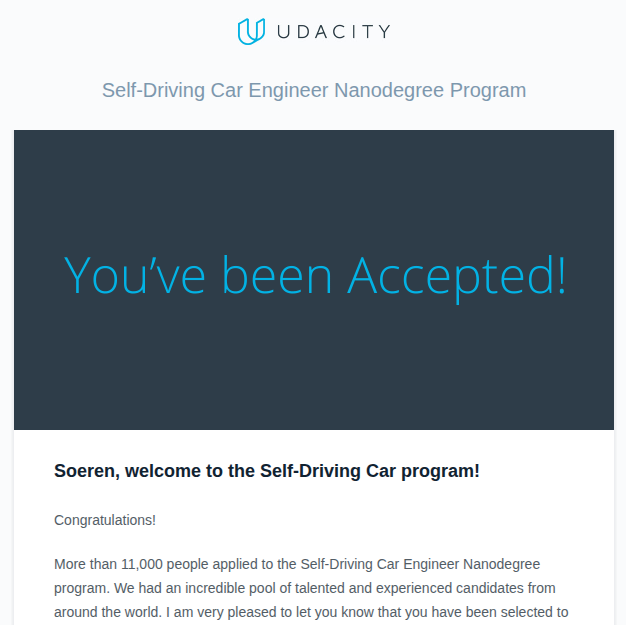



# Self-driven to Earn a Nanodegree

> ✅ “*You’re going to be one of our very first Self-Driving Car students!*”

That was the subject line of the email I received from Udacity in 2016, and I still remember the jolt of excitement (and terror) that ran through me. Out of 11,000+ applicants, I was one of 250 accepted into the inaugural Self-Driving Car Engineer Nanodegree. The catch? I'd only driven a real car a handful of times.



I started Udacity's online course while juggling my senior year at Colorado College, two thesis projects, and a job search that would eventually land me at Google.

The Nanodegree was a wild ride through computer vision, deep learning, estimation, and control. Here’s how I went from drawing lines on road images to unlocking the power of autonomous driving in a car simulator.

- - -

## 1. Finding Lane Lines (Term 1)

> 💡 Core Idea
>
> Before a car can drive itself, it needs to understand the road. The first step is detecting lane lines—crucial for keeping the vehicle safely in its lane and navigating turns.

Armed with OpenCV and a handful of image processing tricks, I built a pipeline that could find lines using color selection, Canny edge detection, and Hough transforms.





```python
# Lane detection pipeline (P1.ipynb)
def pipeline(image):
    gray = cv2.cvtColor(image, cv2.COLOR_RGB2GRAY)
    blur = cv2.GaussianBlur(gray, (5, 5), 0)
    edges = cv2.Canny(blur, 50, 150)
    # ... region of interest, Hough transform, etc.
    return result
```

### The Hough Transform for Lane Detection

After edge detection, the Hough transform is used to find straight line segments that likely correspond to lane lines. The probabilistic Hough transform (`cv2.HoughLinesP`) maps edge points to a parameter space and finds the most likely lines by looking for intersections (votes) in this space.

```python
def hough_lines(img, rho, theta, threshold, min_line_len, max_line_gap):
    """
    img should be the output of a Canny transform.
    Returns an image with hough lines drawn.
    """
    lines = cv2.HoughLinesP(img, rho, theta, threshold, np.array([]),
                            minLineLength=min_line_len, maxLineGap=max_line_gap)
    line_img = np.zeros((img.shape[0], img.shape[1], 3), dtype=np.uint8)
    draw_lines(line_img, lines)
    return line_img

def draw_lines(img, lines, color=[255, 0, 0], thickness=2):
    """
    Draws lines on the image inplace.
    """
    for line in lines:
        for x1, y1, x2, y2 in line:
            cv2.line(img, (x1, y1), (x2, y2), color, thickness)
```

Typical parameters:

```python
rho = 1            # distance resolution in pixels
theta = np.pi/180  # angular resolution in radians
threshold = 10     # minimum number of votes (intersections in Hough grid cell)
min_line_len = 20  # minimum length of a line (pixels)
max_line_gap = 300 # maximum allowed gap between line segments to treat them as a single line
```

Usage in the pipeline:

```python
edges = cv2.Canny(blurred_img, 50, 150)
line_img = hough_lines(edges, rho, theta, threshold, min_line_len, max_line_gap)
result = weighted_img(line_img, original_img)
```

### Advanced Lane Detection

Beyond this, creating a robust solution for advanced lane detection involved iteratively tuning the color and gradient thresholds to create a robust binary image, experimenting with different combinations until the lane lines were reliably detected under varying lighting and road conditions. Key improvements included applying erosion and dilation to the directional binary output to remove isolated noise pixels, and using a positional mask to focus only on the relevant road area.

Handling cases where the lane detection sanity check failed was another challenge: initially, failed detections would trigger a full-image search, but if that also failed, the algorithm would fall back to drawing the average of the past 10 successful frames, greatly reducing erratic lane line behavior. These steps, along with careful perspective transforms and polynomial fitting, made the pipeline much more robust and predictable, even when lane markings were faint, partially missing, or barely visible under shadows.



*Reflection*: At first, I grouped line segments by slope (left/right), averaged their positions, and extrapolated to the bottom of the frame. Later, I improved robustness by clustering points and fitting lines of best fit, and even filtered for yellow/white in HSV color space for challenging lighting.

- - -

## 2. Traffic Sign Recognition & Deep Learning

Next up: teaching a neural network to recognize traffic signs from the [German Traffic Sign Dataset](http://benchmark.ini.rub.de/?section=gtsrb&subsection=dataset). This was [not my first](../ai-block-plan/) real foray into deep learning, but I still spent way too long tuning hyperparameters and staring at loss curves.



### How the Classifier Works

* **Data:** The model is trained on 32x32 RGB images, each labeled with one of 43 possible traffic sign classes. The dataset is diverse, with thousands of images per class, and includes real-world variations in lighting, angle, and occlusion.
* **Preprocessing:** Images are normalized to the range \[0.1, 0.9] for better convergence. I also shuffled the data before each epoch to help the model generalize.
* **Architecture:** The network is a custom convolutional neural network (CNN) inspired by LeNet, but deeper and adapted for color images and more classes. It uses three convolutional layers, each followed by ReLU activations and max pooling, then flattens and passes through two dense layers before the final softmax output.

### Neural Network Architecture (TensorFlow)


```python
# TrafficNet architecture (simplified)
def TrafficNet(x, dropout):
    # Layer 1: Conv2D, 5x5 kernel, 6 filters, ReLU
    c1 = conv2d(x, weights['wc1'], biases['bc1'], strides=1)
    # MaxPool 2x2
    p1 = maxpool2d(c1, k=2)
    # Layer 2: Conv2D, 3x3 kernel, 10 filters, ReLU
    c2 = conv2d(p1, weights['wc2'], biases['bc2'], strides=1)
    # MaxPool 2x2
    p2 = maxpool2d(c2, k=2)
    # Layer 3: Conv2D, 3x3 kernel, 16 filters, ReLU
    c3 = conv2d(p2, weights['wc3'], biases['bc3'], strides=1)
    # Flatten
    flat = flatten(c3)
    # Dense 120 + ReLU
    fc1 = tf.nn.relu(tf.matmul(flat, weights['wd1']) + biases['bd1'])
    # Dense 86 + ReLU
    fc2 = tf.nn.relu(tf.matmul(fc1, weights['wd2']) + biases['bd2'])
    # Output: Dense 43 (Softmax)
    logits = tf.matmul(fc2, weights['wd3']) + biases['bd3']
    return logits
```

### Training & Results

* The model was trained using cross-entropy loss and dropout for regularization. I monitored validation accuracy after each epoch and tweaked the learning rate and dropout to avoid overfitting.
* After several rounds of tuning, the final model achieved high accuracy on the test set and could reliably classify real-world traffic sign images—even with noise and distortion.

*Side note*: Building and tuning this network gave me a much deeper appreciation for the power (and quirks) of deep learning. Watching the model go from random guesses to near-perfect accuracy was like watching a child learn to read—except the child is a bundle of matrix multiplications.

- - -

## 3. Behavioral Cloning: Teaching a Car to Drive Like Me

> 💡 Core Idea
>
> To automate driving, the car needs to learn how to steer based on what it "sees." Behavioral cloning uses deep learning to mimic human driving by mapping camera images to steering commands.

I collected training data by manually driving laps in the Udacity simulator, focusing on center-lane driving, recovery from the sides, and even driving in reverse for robustness. Only the center camera images were used for simplicity.



I experimented with different combinations of data: sometimes including recovery and reverse driving, sometimes just center lane, and even data from a second, more challenging track. Interestingly, the model trained only on center lane data performed best on the original track, while the more diverse data helped on the harder track but sometimes made the car less reliable on the first.

To augment the dataset, I flipped images and steering angles, effectively doubling the data and helping the model generalize:

```python
# Data augmentation: flipping images and angles
def augment(sample):
    image, angle = sample
    flipped_image = cv2.flip(image, 1)
    flipped_angle = -angle
    return [(image, angle), (flipped_image, flipped_angle)]
```

A Python generator efficiently loaded and preprocessed images in batches, including shuffling and flipping:

```python
# Data generator for efficient training
def generator(samples, batch_size=32):
    num_samples = len(samples)
    while True:
        shuffle(samples)
        for offset in range(0, num_samples, batch_size):
            batch_samples = samples[offset:offset+batch_size]
            images, angles = [], []
            for image, angle in batch_samples:
                images.append(image)
                angles.append(angle)
            yield np.array(images), np.array(angles)
```

Cropping layers in the model removed irrelevant parts of the image (like the sky and car hood), and a dropout layer helped reduce overfitting. I used a validation split and found that training for just two epochs was optimal—more led to overfitting.

A fun (and frustrating) discovery: the simulator provided images in BGR format, but my model was trained on RGB. Fixing this bug in `drive.py` made a big difference:

```python
# Convert BGR to RGB before prediction
display_image = cv2.cvtColor(image, cv2.COLOR_BGR2RGB)
```

The final model, based on the NVIDIA architecture, used several convolutional layers, RELU activations, max pooling, dropout, and dense layers:

```python
model = Sequential()
model.add(Lambda(lambda x: x / 255.0 - 0.5, input_shape=(160,320,3)))
model.add(Cropping2D(cropping=((70,25), (0,0))))
model.add(Conv2D(24, (5, 5), activation='relu'))
model.add(MaxPooling2D((2, 2)))
model.add(Conv2D(36, (5, 5), activation='relu'))
model.add(MaxPooling2D((2, 2)))
model.add(Conv2D(48, (5, 5), activation='relu'))
model.add(MaxPooling2D((2, 2)))
model.add(Conv2D(64, (3, 3), activation='relu'))
model.add(Dropout(0.5))
model.add(Flatten())
model.add(Dense(100, activation='relu'))
model.add(Dense(50, activation='relu'))
model.add(Dense(10))
model.add(Dense(1))
```

After much iteration, the best model could drive autonomously around the track without leaving the road—at least, most of the time!



- - -

## 4. Estimation & Localization: Kalman Filters and Particle Filters (Term 2)

> 💡 Core Idea
>
> In robotics and autonomous vehicles, knowing exactly where you are is surprisingly hard. Sensors are noisy, the world is unpredictable, and GPS alone isn’t nearly accurate enough. That’s where estimation algorithms like Kalman filters and particle filters come in...

They combine noisy sensor data and a model of the system to estimate the true state of the vehicle—such as its position, velocity, and orientation—over time. Kalman filters are optimal for linear systems with Gaussian noise, while particle filters can handle highly nonlinear, non-Gaussian problems by representing the state as a set of random samples (particles).

Term 2 was where things got real. I implemented:

### Extended Kalman Filter (EKF)

The EKF fuses noisy lidar and radar data to estimate a moving object's state. The core update and prediction steps look like this:

```cpp
// kalman_filter.cpp (EKF)
void KalmanFilter::Predict() {
    x_ = F_ * x_;
    MatrixXd Ft = F_.transpose();
    P_ = F_ * P_ * Ft + Q_;
}

void KalmanFilter::Update(const VectorXd &z) {
    VectorXd z_pred = H_ * x_;
    VectorXd y = z - z_pred;
    MatrixXd Ht = H_.transpose();
    MatrixXd S = H_ * P_ * Ht + R_;
    MatrixXd Si = S.inverse();
    MatrixXd PHt = P_ * Ht;
    MatrixXd K = PHt * Si;

    // new estimate
    x_ = x_ + (K * y);
    long x_size = x_.size();
    MatrixXd I = MatrixXd::Identity(x_size, x_size);
    P_ = (I - K * H_) * P_;
}
```

For radar, the update step uses the nonlinear measurement function and its Jacobian:

```cpp
void KalmanFilter::UpdateEKF(const VectorXd &z) {
    VectorXd h = tools.hFunction(x_);
    MatrixXd Hj = tools.CalculateJacobian(x_);
    VectorXd y = z - h;
    // normalize angle phi to [-pi, pi]
    // ... (angle normalization code)
    MatrixXd Ht = Hj.transpose();
    MatrixXd S = Hj * P_ * Ht + R_;
    MatrixXd Si = S.inverse();
    MatrixXd PHt = P_ * Ht;
    MatrixXd K = PHt * Si;

    x_ = x_ + (K * y);
    long x_size = x_.size();
    MatrixXd I = MatrixXd::Identity(x_size, x_size);
    P_ = (I - K * Hj) * P_;
}
```

*Reflection*: Debugging the EKF was a crash course in linear algebra and sensor fusion. Getting the Jacobian and angle normalization right was tricky, but seeing the filter track a car’s position in real time was incredibly satisfying.

- - -

### Unscented Kalman Filter (UKF)

The UKF handles nonlinearities better by propagating a set of sigma points through the process and measurement models:

```cpp
// ukf.cpp (UKF)
void UKF::Prediction(double delta_t) {
    SigmaPointPrediction(delta_t);
    PredictMeanAndCovariance();
}
```

Sigma points are generated and predicted as follows:

```cpp
MatrixXd UKF::AugmentedSigmaPoints() {
    // create augmented mean vector, covariance, and sigma points
    // ...
    return Xsig_aug;
}

void UKF::SigmaPointPrediction(double delta_t) {
    MatrixXd Xsig_aug = AugmentedSigmaPoints();
    // predict each sigma point
    // ...
}
```

The update step for radar uses the predicted sigma points to compute the mean and covariance of the predicted measurement, then updates the state:

```cpp
void UKF::UpdateRadar(MeasurementPackage measurement_pack) {
    // PredictRadarMeasurement, then UpdateState
}
```

*Reflection*: The UKF felt like magic—no more linearization headaches, just a cloud of sigma points smoothly tracking the car. But tuning all those noise parameters and weights was a delicate balancing act.

- - -

### Particle Filter

For the “kidnapped vehicle” project, I implemented a 2D particle filter in C++. The filter maintains a set of particles, each representing a possible state. At each step, it predicts, updates weights based on sensor observations, and resamples:

```cpp
// particle_filter.cpp (core methods)
void ParticleFilter::init(double x, double y, double theta, double std[]) {
    // Initialize particles with Gaussian noise
}

void ParticleFilter::prediction(double delta_t, double std_pos[], double velocity, double yaw_rate) {
    // Predict new state for each particle
}

void ParticleFilter::updateWeights(double sensor_range, double std_landmark[],
                const std::vector<LandmarkObs> &observations, const Map &map_landmarks) {
    // Update weights using multivariate Gaussian
}

void ParticleFilter::resample() {
    // Resample particles with probability proportional to their weight
}
```

*Reflection*: The particle filter was both conceptually simple and surprisingly powerful. Watching the “cloud” of particles converge on the true position was a great visual for how probabilistic localization works. The biggest challenge was making the filter robust to noisy data and ensuring it ran fast enough for real-time use.

- - -

**Summary**: Implementing these filters gave me a deep appreciation for estimation theory. Each approach—EKF, UKF, and particle filter—has its strengths and quirks, but all share the same goal: making sense of a noisy, uncertain world.

- - -

## 5. PID Controller: My First Taste of Control

> 💡 Core Idea
>
> Controlling a car means more than just knowing where you are—you need to keep the car on track. PID controllers are a classic way to minimize errors and keep the vehicle centered and stable.



This project made the math of PID finally "click" for me. Here’s what I learned:

* **P (Proportional):** Controls how aggressively the car reacts to being off-center. Too high and the car wobbles; too low and it’s sluggish.
* **I (Integral):** Only useful if there’s a consistent bias (like a wheel misalignment). For this project, I set it to zero.
* **D (Derivative):** Smooths out the reaction, making steering more stable. Too low and the car oscillates; too high and it becomes unresponsive.

I manually tuned the parameters by trial and error in the simulator, aiming for a balance between quick correction and smooth driving. My best values:

* **Steering:** P = -0.2, I = 0.0, D = -3.0
* **Throttle:** P = -0.6, I = 0.0, D = 1.0

```cpp
// PID update (PID.cpp)
double diff_cte = cte - prev_cte;
int_cte += cte;
double steer = -Kp * cte - Kd * diff_cte - Ki * int_cte;
```

I also used a PID controller for throttle, targeting a constant speed. The result? The car slowed down for sharp turns and sped up on straights—almost like a cautious human driver. Watching the effects of each parameter in real time was both enlightening and oddly satisfying.

- - -

## 6. Model Predictive Control (MPC): The Big Leagues

> 💡 Core Idea
>
> For more advanced driving, the car must plan ahead, predicting its future path and optimizing control inputs. MPC enables this by solving an optimization problem at every step: predicting future states and optimizing control inputs over a time horizon. It’s like chess, but for cars.



*Note*: In the simulation above, the yellow line represents the "ideal" trajectory at the center of the road, while the green line shows the car's actual computed trajectory.

My MPC model followed the Udacity approach closely. The state vector included:

* x position
* y position
* steering angle (psi)
* velocity
* cross-track error
* orientation (psi) error

The actuators were steering and throttle. The cost function combined:

* cross-track error
* orientation error
* actuator changes (to penalize rapid steering/throttle changes)

I experimented with different prediction horizons and timestep lengths. After some trial and error, I settled on **N = 10** and **dt = 0.1** (so the prediction horizon T = 1 second). This was long enough for meaningful predictions but short enough for real-time computation. (Longer horizons were too slow; shorter ones didn’t give the car enough foresight.)

Before calling `MPC.Solve()`, I preprocess the waypoints by shifting the car’s reference frame to the origin and rotating it so the path ahead is horizontal. This makes polynomial fitting much simpler and more robust.

```cpp
// MPC cost function (MPC.cpp)
for (int t = 0; t < N; t++) {
    fg[0] += w_cte * CppAD::pow(cte[t], 2);
    fg[0] += w_epsi * CppAD::pow(epsi[t], 2);
    fg[0] += w_v * CppAD::pow(v[t] - ref_v, 2);
}
```

One of the trickiest parts was handling latency. The simulator introduced a 100ms delay between sending actuator commands and seeing the result. To compensate, I simulated the car’s state forward by 100ms before running MPC, using the current steering and throttle values. This made the controller much more robust—almost as if there was no latency at all.

*Reflection*: The jump from PID to MPC felt like going from driving a go-kart to piloting a spaceship. Suddenly, I was thinking in terms of trajectories, constraints, and optimization. Tuning those hyperparameters was a balancing act between accuracy and computational cost, but when it worked, it felt like magic.

- - -

## 7. Path Planning & Semantic Segmentation (Term 3)

> 💡 Core Idea
>
> A truly autonomous car must plan safe paths and understand its environment at a pixel level. Path planning and semantic segmentation allow the car to navigate complex roads and identify drivable space.

### Path Planning (C++)

The path planning project felt like the final exam, bringing together localization, prediction, and control into one C++ application. The goal was to build a "brain" that could safely navigate a busy highway, and the simulator didn't pull any punches.

The challenge, as laid out in the project goals, was to make a car that drove *politely* but *efficiently*. It had to:

* Stay as close as possible to the 50 MPH speed limit.
* Automatically detect and overtake slower traffic by changing lanes.
* Avoid collisions at all costs.
* And crucially, do it all smoothly, without exceeding strict limits on acceleration and jerk. No one likes a jerky robot driver.

At every time step (every 0.02 seconds, to be exact!), the simulator fed my C++ program a stream of data: my car's precise location and speed, and a `sensor_fusion` list detailing the position and velocity of every other car on my side of the road.

My code's job was to act as a behavior planner using [subsumption architecture](/project/arduino-robot/#how-it-works). It would parse the sensor data to answer key questions:

* Is there a car directly ahead of me? If so, how far?
* Should I slow down to match its speed?
* Or, is the lane to my left or right clear for a pass?

Once the planner decided on an action (e.g., "prepare for a left lane change"), the next step was generating a smooth path. For this, I used a fantastic C++ spline library that was recommended in the project tips. It allowed me to take a few key waypoints—based on the car's current state and its target destination—and interpolate a fluid, continuous trajectory for the car to follow.

```cpp
// Example: Find closest waypoint to start the path planning
int ClosestWaypoint(double x, double y, const vector<double> &maps_x, const vector<double> &maps_y) {
    // ... logic to find the nearest map waypoint ...
    return closestWaypoint;
}
```

```cpp
// Using the spline library to generate the trajectory
#include "spline.h"
tk::spline s;
// Set anchor points for the spline based on current state and target
s.set_points(ptsx, ptsy);

// Populate the next path points by evaluating the spline
vector<double> next_x_vals, next_y_vals;
for (int i = 0; i < 50; i++) {
    // ... calculate points along the spline ...
    next_x_vals.push_back(x_point);
    next_y_vals.push_back(s(x_point));
}
```

The beating heart of the project was a giant lambda function inside `main.cpp`: the `h.onMessage` handler. This function was called every 0.02 seconds with a fresh batch of telemetry data. This is where the magic happened: my code had to parse the car's state, analyze the positions of all other cars on the road, and generate a safe and smooth trajectory—all in a fraction of a second.

Here’s a look at the structure of that handler, with pseudo-code outlining my decision-making logic:

```cpp
// main.cpp
h.onMessage([&map_waypoints_x,...](uWS::WebSocket<uWS::SERVER> ws, char *data, size_t length, uWS::OpCode opCode) {
    // ... JSON parsing ...
    if (event == "telemetry") {
        // Get main car's localization data
        double car_x = j[1]["x"];
        double car_y = j[1]["y"];
        double car_s = j[1]["s"];
        double car_d = j[1]["d"];
        double car_speed = j[1]["speed"];

        // Get sensor fusion data: a list of all other cars
        auto sensor_fusion = j[1]["sensor_fusion"];
        
        // --- My Logic Started Here ---

        // 1. Analyze the current situation using sensor_fusion data
        bool car_ahead = false;
        bool car_left = false;
        bool car_right = false;
        for (int i = 0; i < sensor_fusion.size(); i++) {
            // Check if a car is in my lane, too close
            // Check if cars are in the left/right lanes, blocking a change
        }

        // 2. Behavior Planning: Decide what to do
        double target_speed = 49.5; // MPH
        int target_lane = 1; // 0=left, 1=center, 2=right
        if (car_ahead) {
            if (!car_left) {
                target_lane = 0; // Change to left lane
            } else if (!car_right) {
                target_lane = 2; // Change to right lane
            } else {
                target_speed -= .224; // Slow down to match car ahead
            }
        } else if (car_speed < 49.5) {
            target_speed += .224; // Speed up to limit
        }

        // 3. Trajectory Generation using the spline library
        // Create anchor points for the spline based on current state and target_lane/target_speed
        // ... (as described in the spline example) ...
        tk::spline s;
        s.set_points(anchor_pts_x, anchor_pts_y);

        // Populate next_x_vals and next_y_vals with points from the spline
        // ...

        // Send the new path back to the simulator
        json msgJson;
        msgJson["next_x"] = next_x_vals;
        msgJson["next_y"] = next_y_vals;
        auto msg = "42[\"control\","+ msgJson.dump()+"]";
        ws.send(msg.data(), msg.length(), uWS::OpCode::TEXT);
    }
});
```

This approach of behavior planning combined with spline-based trajectory generation created a system that could navigate dynamic traffic safely and effectively. It was incredibly satisfying to watch my car make its own decisions to speed up, slow down, and weave through traffic to complete a full lap of the 6946-meter highway loop.

### Semantic Segmentation (Python/TensorFlow)

The semantic segmentation project uses a Fully Convolutional Network (FCN) to label each pixel in an image as "road" or "not road." This is where the magic of deep learning gets visual.

> 💡 Core Idea
>
> The goal isn't just to classify an image, like we were doing [with traffic signs in Term 1](#2-traffic-sign-recognition--deep-learning), but rather to understand its content at a granular level.

The architecture is an FCN-8, a network famous for this kind of task, built on top of a pre-trained VGG16 model. A key tip from the project documentation was that the provided VGG model wasn't vanilla; it was already a "fully convolutional version," meaning its dense final layers had been swapped for 1x1 convolutions. This was a huge head start, as it meant I could directly tap into the rich feature maps from deep within the network.

The core of my implementation was the `layers` function, which reconstructs the final output by upsampling and combining layers from VGG. This is where the skip connections come in, merging the coarse, semantic information from deep layers with the fine, spatial information from shallower ones.

```python
# main.py
def layers(vgg_layer3_out, vgg_layer4_out, vgg_layer7_out, num_classes):
    """
    Create the layers for a fully convolutional network.  Build skip-layers using the vgg layers.
    """
    # 1x1 convolution of vgg layer 7
    conv_7 = tf.layers.conv2d(vgg_layer7_out, num_classes, 1, strides=(1,1),
                                padding='same', kernel_regularizer=tf.contrib.layers.l2_regularizer(1e-3))
    # Upsample layer 7 output
    output_7 = tf.layers.conv2d_transpose(conv_7, num_classes, 4, strides=(2,2),
                                            padding='same')

    # 1x1 convolution of vgg layer 4
    conv_4 = tf.layers.conv2d(vgg_layer4_out, num_classes, 1, strides=(1,1),
                                padding='same', kernel_regularizer=tf.contrib.layers.l2_regularizer(1e-3))
    # Skip connection: add upsampled layer 7 to layer 4
    skip_4 = tf.add(output_7, conv_4)
    # Upsample the combined layer
    output_4 = tf.layers.conv2d_transpose(skip_4, num_classes, 4, strides=(2,2),
                                            padding='same')

    # 1x1 convolution of vgg layer 3
    conv_3 = tf.layers.conv2d(vgg_layer3_out, num_classes, 1, strides=(1,1),
                                padding='same', kernel_regularizer=tf.contrib.layers.l2_regularizer(1e-3))
    # Skip connection: add upsampled layer 4 to layer 3
    skip_3 = tf.add(output_4, conv_3)
    # Final upsample to restore original image size
    output_3 = tf.layers.conv2d_transpose(skip_3, num_classes, 16, strides=(8,8),
                                            padding='same')

    return output_3
```

I trained the network on the [KITTI Road dataset](https://www.cvlibs.net/datasets/kitti/eval_road.php) for 50 epochs with a batch size of 5. One of the trickiest parts was getting the L2 regularization right.

> 💡 Tip
>
> Udacity's project instructions had a crucial tip: simply adding `kernel_regularizer` to the `tf.layers` calls isn't enough in TensorFlow 1.x. You have to *manually* fetch the regularization losses and add them to your main cross-entropy loss function. It's a classic "gotcha" that could easily go unnoticed.

The final model, trained with an Adam optimizer and a learning rate of `0.0008`, produced some beautifully segmented images where the drivable area is highlighted.



*Fun fact*: Seeing the model color in the road beneath the cars is weirdly satisfying.

- - -

## Reflections on Sacrifices Made

The final project in Term 3 of the Nanodegree was the only one I didn't complete, since I was too distracted by my new job in Google's Engineering Residency. Udacity took a back seat while I prioritized converting onto my team as a FTE in Google Cloud, which I did successfully!

The final assignment was to combine the major concepts from all 3 terms into, you guessed it, a fully autonomous driving system for a virtual car. That is now left as an exercise for both the reader and the author. ;)

- - -

## Source Code



- - -

*If you have any questions, let me know in the comments!*
